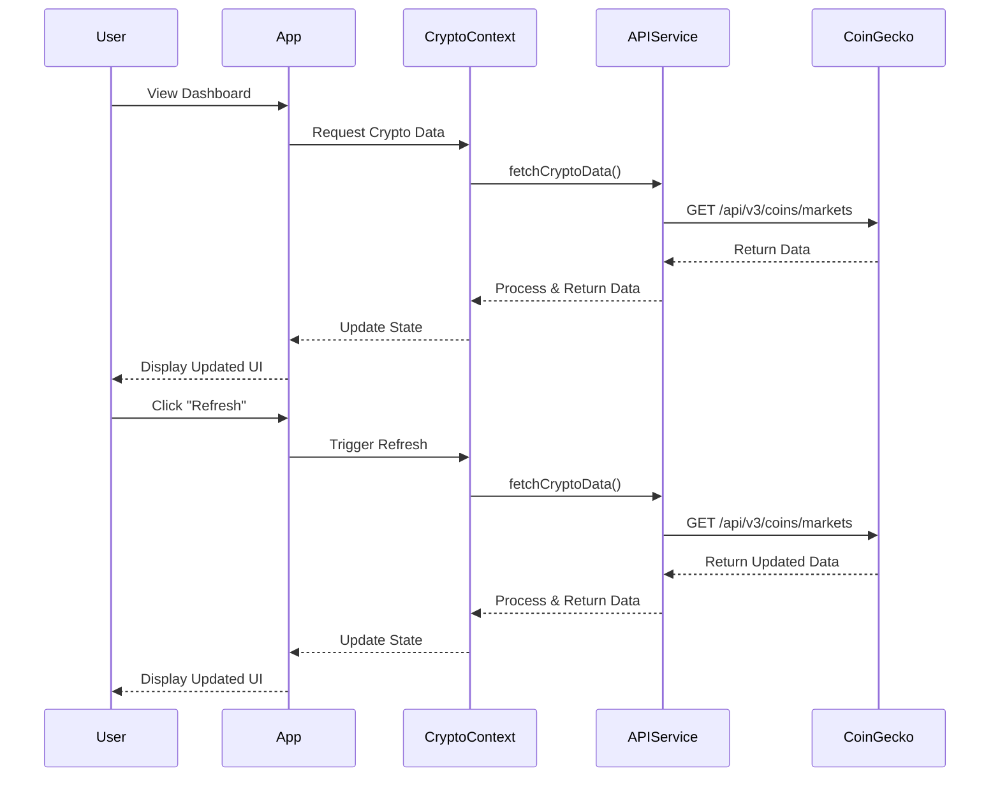
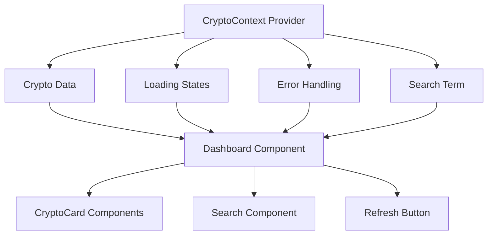
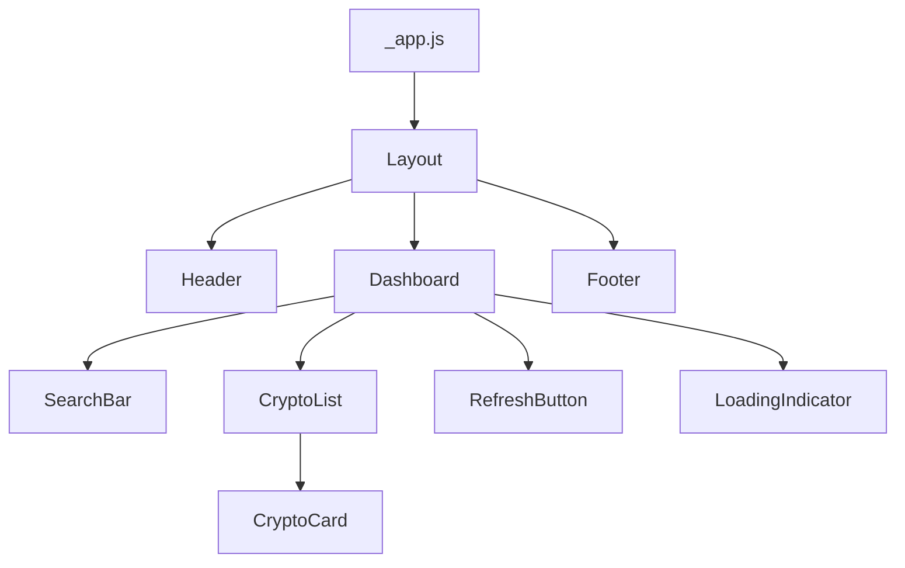
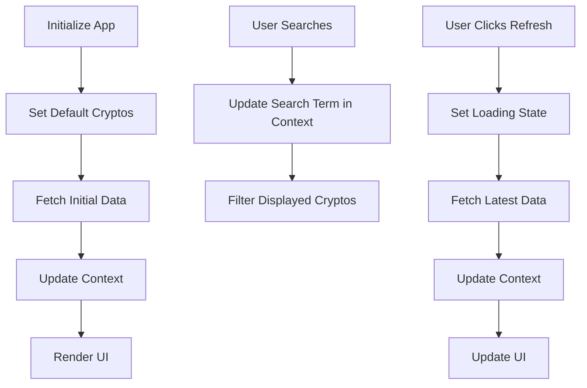

# Crypto Price Tracker - Detailed Architecture Plan

## Project Overview

We'll build a cryptocurrency price tracker with:

1. **Next.js Web App** - A dashboard displaying live prices of 5 cryptocurrencies (including Bitcoin and Ethereum), with search functionality and manual refresh
2. **Docusaurus Documentation** - Complete developer documentation explaining the approach, setup, and implementation details

## Project Structure

```
crypto-price-tracker/
├── web-app/               # Next.js application
│   ├── app/               # App router structure
│   ├── components/        # Reusable UI components
│   ├── context/           # Context API for state management
│   ├── hooks/             # Custom hooks
│   ├── services/          # API service layer
│   ├── styles/            # Global styles
│   └── types/             # TypeScript type definitions
│
├── docs/                  # Docusaurus documentation
│   ├── docs/              # Documentation content
│   ├── src/               # Custom components
│   ├── static/            # Static assets
│   └── docusaurus.config.js
│
└── README.md              # Project overview
```

## Web App Architecture

### 1. API Integration

We'll use the CoinGecko API with the provided key to fetch cryptocurrency data.



### 2. State Management with Context API

We'll use React's Context API to manage application state:



### 3. Component Structure



### 4. Data Flow



## Key Components

### 1. Dashboard

The main container component that houses all crypto-related UI elements.

### 2. CryptoCard

Displays individual cryptocurrency data:
- Icon
- Name and Symbol
- Current Price
- 24h Price Change (%)
- Market Cap

### 3. SearchBar

Allows filtering the displayed cryptocurrencies by name or symbol.

### 4. RefreshButton

Manually triggers a data refresh with a loading indicator.

### 5. LoadingIndicator

Displays during API calls to indicate data is being fetched.

## API Service Layer

```typescript
// API Service Structure
interface CryptoData {
  id: string;
  symbol: string;
  name: string;
  image: string;
  current_price: number;
  price_change_percentage_24h: number;
  market_cap: number;
}

// Default cryptos to display
const DEFAULT_CRYPTOS = ['bitcoin', 'ethereum', 'ripple', 'cardano', 'solana'];

// Fetch cryptocurrency data
const fetchCryptoData = async (): Promise<CryptoData[]> => {
  try {
    const response = await fetch(
      'https://api.coingecko.com/api/v3/coins/markets?vs_currency=usd&ids=${DEFAULT_CRYPTOS.join(",")}&order=market_cap_desc',
      {
        headers: {
          'X-CoinGecko-API-Key': 'CG-vdUFSAZyCF9R8r6qUwFLH1nP'
        }
      }
    );
    
    if (!response.ok) {
      throw new Error('Failed to fetch crypto data');
    }
    
    return await response.json();
  } catch (error) {
    console.error('Error fetching crypto data:', error);
    throw error;
  }
};
```

## Context API Implementation

```typescript
// CryptoContext Structure
interface CryptoContextType {
  cryptoData: CryptoData[];
  filteredData: CryptoData[];
  isLoading: boolean;
  error: Error | null;
  searchTerm: string;
  refreshData: () => Promise<void>;
  setSearchTerm: (term: string) => void;
}

// Context Provider will:
// 1. Fetch initial data on mount
// 2. Provide refreshData method
// 3. Handle search filtering
// 4. Manage loading states
```

## Docusaurus Documentation Structure

```
docs/
├── intro.md                    # Project overview & quick start
├── setup/
│   ├── prerequisites.md        # Required dependencies
│   ├── installation.md         # Installation steps
│   └── configuration.md        # Configuration options
├── architecture/
│   ├── overview.md             # High-level architecture
│   ├── api-integration.md      # API integration details
│   └── state-management.md     # Context API implementation
├── components/
│   └── component-overview.md   # Component documentation
└── challenges/
    └── solutions.md            # Challenges faced and solutions
```

## Implementation Plan

### Phase 1: Project Setup (1-2 hours)
- Set up Next.js with Tailwind CSS
- Set up Docusaurus
- Create basic project structure
- Install dependencies

### Phase 2: API Integration (2-3 hours)
- Create API service layer
- Implement context API structure
- Set up data fetching and error handling

### Phase 3: UI Components (3-4 hours)
- Build Dashboard layout
- Create CryptoCard component
- Implement SearchBar
- Add RefreshButton with loading state
- Style UI with Tailwind CSS

### Phase 4: Documentation (2-3 hours)
- Write setup guides
- Document API integration
- Explain state management approach
- Document challenges and solutions

### Phase 5: Testing & Polish (1-2 hours)
- Test functionality
- Ensure responsive design
- Optimize performance
- Final adjustments

## Technical Decisions

1. **Next.js App Router**: Using the latest Next.js app router for modern routing and layout capabilities.

2. **Context API for State Management**: As requested, we'll use Context API for managing application state. This approach is suitable for this application's complexity level and provides:
   - Centralized state management
   - Avoids prop drilling
   - Simple implementation for our use case

3. **Tailwind CSS**: For rapid UI development with utility classes.

4. **TypeScript**: For type safety and better developer experience.

5. **Incremental Static Regeneration (ISR)**: To optimize performance while keeping data relatively fresh.

## Error Handling Strategy

1. **API Failures**: Display user-friendly error messages with retry options
2. **Rate Limiting**: Implement backoff strategy for API requests
3. **Data Validation**: Validate API responses before updating state
4. **Fallback UI**: Show fallback UI when data cannot be fetched